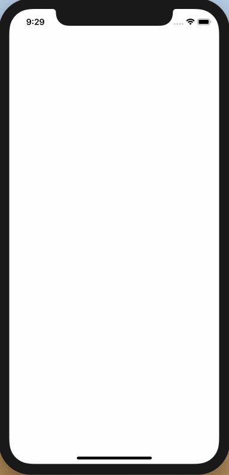

# HospitalApp
Hospital App

## What does it do?
This app connects to a public API to download a CSV file containing hospitals in the UK.

## How to run?
Simpy download or git clone, checkout develop or master, open xcode project and run. When the app is running and you've got data downloaded, you can toggle the switch on to only show you **NHS Sector** hospitals. 

## Dependencies?
None.

## Screen recording

